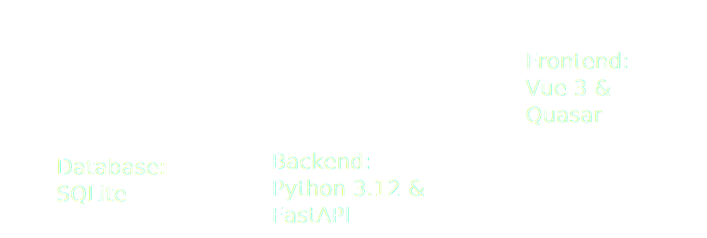

# ShotIQ

ShotIQ is a golf shot data analysis application designed to help golfers upload and analyze data from their golf simulator sessions. By leveraging data insights, ShotIQ provides a comprehensive breakdown of your golf performance, helping you identify patterns, improve your swings, and refine your overall game.

## Features

- **Upload Golf Session Data**: Easily upload CSV files or other data formats from your golf simulator.
- **Shot Data Analysis**: Get detailed analytics on your swing, ball flight, distances, accuracy, and more.
- **Visualizations**: Graphical insights to track shot-by-shot performance, club analysis, and trends over time.
- **Session Comparison**: Compare multiple sessions to observe improvements or areas that need attention.

## High-Level Architecture Design

